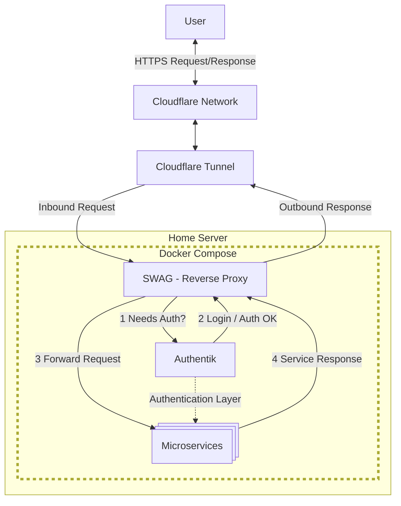

This thing started with an email from Google. "You've used 90% of storage," it said. Now, it was not the first time receiving a similar email. I was using Google's free tier (15GB) for my Gmail data and Google Photos[^GPhotos], which fills up pretty quickly. When that happened, I would normally sieve through my data and remove the chunkiest videos and files to free up some space. However, that was not a great solution long term.

The cheapest Google One plan costs around £2 a month and gives you 100GB, which should have been enough at least for a couple of years. However, apart from the limited storage, depending on Google for my personal photos made me uneasy. Since they pulled the rug on the free storage, they could easily increase prices at will or stop the service altogether if they wanted to. And then there was privacy.

The solution I chose was to build a personal server I could use to host my photos.

[^GPhotos]: There used to be world in which Google Photos offered unlimited free storage for standard resolution photos. Google [changed that policy](https://blog.google/products/photos/storage-changes/) and photos started to count as part of the free 15GB storage on the 1st of June 2021. Probably they had enough data to train vision models by then.

## Hardware setup

A personal server is nothing more than a computer you can access remotely. So the first thing you need is a computer.

Luckily, I had recently got my hands on a Raspberry Pi 5 with 8GB of memory. I had used Raspberry Pis in the past, and they are great. I used the Raspberry Pi because I already had it, and I knew I could repurpose it for something else if I wanted.

That said, if I did not have one, I might have considered buying a second-hand mini PC instead. Overall, it's a more cost-effective solution in this case. You can buy a decent second-hand mini PC very cheap on eBay and get a computer with better specs than the Pi, including NVMe storage. If you opt for the Pi, you will need to buy a case and storage separately.


| Raspberry Pi | Mini PC |
| ------- | ------- |
| <ul><li>Compact size, portable</li><li>Great documentation</li><li>Low power consumption</li><li>Easy headless setup</li></ul> | <ul><li>Better Specs</li> <li>Cheaper (used options too)</li><li>Upgradable components</li><li>Good storage out the box</li></ul>

To be fair, I have taken the server with me multiple times while travelling, and the small size and weight are great for that. I also splurged on a fancy aluminium case and SSD storage. All in, the value of my setup is a whopping £177. 


| Item | Approximate Price (£) |
| ------ | -------: |
| [Raspberrry Pi 5 8GB](https://www.raspberrypi.com/products/raspberry-pi-5/) | 78 |
| [Argon Neo 5 NVMe](https://argon40.com/en-gb/products/argon-neo-5-m-2-nvme-for-raspberry-pi-5) | 35 |
| [Kingston NV2 1TB NVMe](https://www.overclockers.co.uk/kingston-nv2-1tb-pcie-4.0-nvme-m.2-solid-state-drive-snv2s-1000g-hd-10u-ks.html) | 48 |
| Power supply | 10 |
| Micro SD card 32 GB | 6 |
| **Total** |  177 |


## Setup
### Orchestration: Docker
Before we discuss the networking setup, this section discusses the orchestration setup that the server uses to run multiple micro-services at once.

The architecture of the server is based on [Docker](https://docs.docker.com/) containers, which host the individual
services. [Docker compose](https://docs.docker.com/compose/) is used to orchestrate the containers and provision bridge
networks to provide internal communications.

Docker compose is great, and it has the advantage that most open source self-hosted services provide
docker compose files that you can copy into your project. 

<details>
<summary>Details on the project structure</summary>

I decided to structure the files as follows
```text
.
├── scripts
│   ├── up.sh // starts all the docker services and bridge network
│   └── down.sh // stops all the services
└──services
    ├── service1
    │   ├── .env
    │   ├── docker-compose.yml
    │   ├── docker-compose.override.yml
    │   └── <service-specific dirs>
    ├── service2
    └── ...
```
Some comments on particular files:
* `.env` is the file to keep all the service-specific secrets. These files should never be committed to a repo.
* `docker-compose.yml` is the main compose project, specifying the containers needed for each of them.
Normally, open source self-hosted apps will provide this file.
* `docker-compose.override.yml` allows you to override the contents of the main compose file.
I use this to attach containers to the bridge network without needing to edit the original docker-compose files.
This separates the original docker compose --which could be downloaded from a different repo-- from the edits needed for our server.

</details>

### Networking: Cloudflare Tunnel
We use an external docker compose bridge network to manage communications between different micro-services.
The next step is to expose the services externally, to the public internet. 

To safely expose the services publicly, I use [Cloudflare Tunnel](https://developers.cloudflare.com/cloudflare-one/connections/connect-networks/).
The benefits are:
* Safe architecture, you are not exposing ports to the open internet
* Easy setup and maintenance, leveraging the Cloudflare dashboard.
* No router setup needed; I can take my tiny server to a new place, connect it to the local network, and it will work again.

The drawback is that you need to obtain a domain, which you can also do in the Cloudflare platform. The cost is quite low (you can find domains for less than £7/year), but it does mean that you have to set up a payment method.

<details>
<summary>Alternatives: port forwarding and VPNs</summary>

The simplest design involves exposing server ports directly to the internet using
port forwarding.
 Although simple in practice, this has major drawbacks:
* Exposing a port directly is not a safe architecture.
* Port forwarding needs to be enabled in the router settings. That means that you need to
set it up again if you move your server to a different location or change the router.
This configuration can't be stored as code.
* Most home networks use dynamic IP addresses. That means that your IP address will change frequently.[^CGNAT]
If you don't want to keep checking and typing your IP in the browser, you could use a 
DNS service (like [duckdns](https://www.duckdns.org/)) to index the server address.

Another common alternative is to use a VPN, where you set up a safe connection via a private network.
However, you will need to configure all client devices to be able to access your VPN remotely.
This made this option inviable, since I wanted to be able to access my server from any device.

</details>

[^CGNAT]: Your Internet Service Provider might not even give you a public IP at all either.
Some providers use what is called [CGNAT](https://en.wikipedia.org/wiki/Carrier-grade_NAT), meaning that you share your public IP with other homes, 
and prevents you from forwarding ports. You might have to give them a call to get out of the CGNAT.

### Reverse proxy and encryption: SWAG
[SWAG](https://docs.linuxserver.io/general/swag/#authorization-method) is a Docker image that makes the process of serving encrypted docker services very easy.
As explained in the documentation, it manages the communications with all your other services and exposes them through a single encrypted port.
To do that it uses
- `nginx` as a reverse proxy, to route each service to its appropriate subdomain/subdirectory.
- `Let's Encrypt` for generation and renewal of TSL certificates. SWAG also supports ZeroSSL as a certificate provider.

Additionally, SWAG [works with Cloudflare Tunnel](https://www.linuxserver.io/blog/zero-trust-hosting-and-reverse-proxy-via-cloudflare-swag-and-authelia)
; meaning that the SWAG service is capable of managing the full deployment.

### Authentication: Authentik
Some services might have built-in user authentication, others might not. 
In any case, I wanted a way to unify all the services under a single sign-on system.
[Authentik](https://docs.goauthentik.io/docs/) is an open source service that does just that.
You can configure Authentik to manage the authentication to all the micro-services, allowing you to control who uses them.
It also allows users to [use Google credentials for authentication](https://docs.goauthentik.io/docs/users-sources/sources/social-logins/google/cloud/), so there is no need for new usernames and passwords.
The official documentation explains how to install Authentik using docker compose [here](https://docs.goauthentik.io/docs/install-config/install/docker-compose).


### Other Services

After all this, the web server is ready to host fantastic micro-services. 
Some of the ones I have installed are:

| Service | Description |
| ------- | ----------- |
| [**Kopia**](https://kopia.io/docs/getting-started/) | Backup service. It has both a CLI and a web interface. I host two Kopia servers and their respective UIs. One backup of the server data and config locally, and the second backups the same data remotely using [Cloudflare R2](https://developers.cloudflare.com/r2/) storage. |
| [**Immich**](https://immich.app/docs/overview/welcome) | Service to host your photos and videos, like your private Google Photos. The self-hosted web app is great, but it also has iOS and Android apps, so you can sync media straight from your phone. There is a [community-made tool](https://github.com/simulot/immich-go) to bulk upload all your data from a Google Photos |
| [**Memos**](https://www.usememos.com/docs) | Memos is a privacy-first, lightweight note-taking service. Great for notes and journaling. You can organise notes by tags and share them publicly. It has a [plugin](https://www.usememos.com/docs/integration/telegram-bot) to save memos from Telegram, although personally I set up an iOS shortcut so that I can type or record a memo and send it directly to the server|


You can discover new self-hosted apps at:
* [awesome-selfhosted](https://github.com/awesome-selfhosted/awesome-selfhosted)
* [selfh.st](https://selfh.st/apps/)


## Summary Diagram


