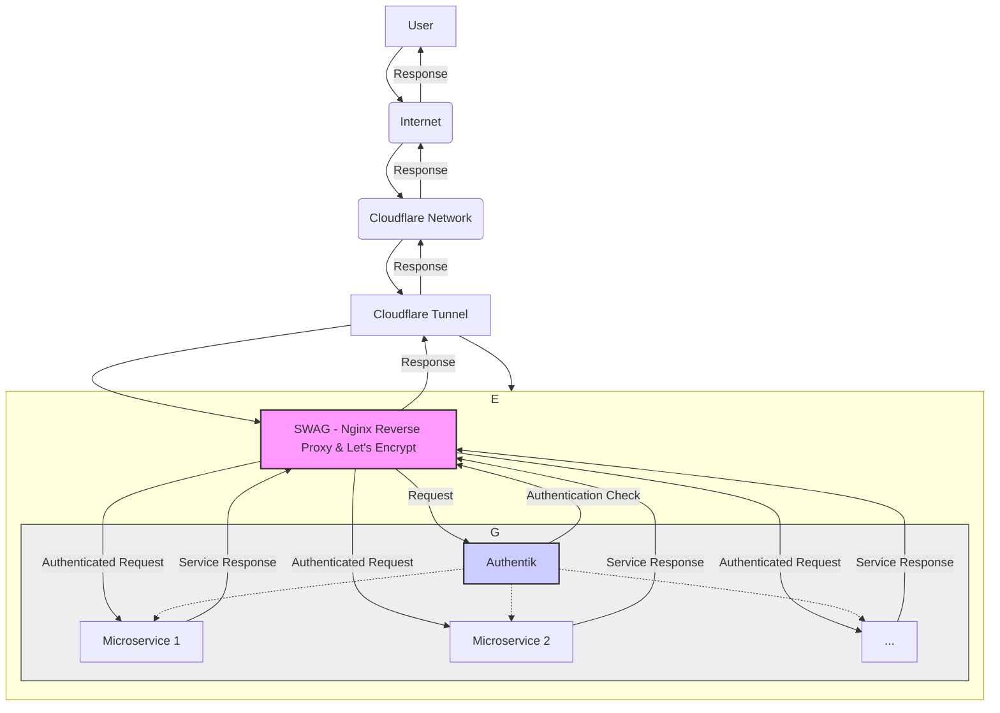

This thing started with an email from Google. You've used 90% of storage, it said. Now, it was not the first time receiving a similar email. I was using Google's free tier (15GB) for my Gmail data and Google Photos[^1], which fills up pretty quickly. When that happened I would normally sieve thought my data and remove the chunkiest videos and files, to free up some space. However, that was not a great solution long term.

The cheapest Google One plan costs around £2 a month and gives you 100GB, which should have been enough at least for a couple of years. However, apart for the limited storage, depending on Google for my personal photos made me unease. Since they pulled the rug on the free storage, they could easily increase prices at will or stop the service altogether if they wanted to. And then there was privacy.

The solution I chose was to build a personal server I could use to host my (and my family's) photos. 

I recommend [this post](https://estherschindler.medium.com/the-old-family-photos-project-lessons-in-creating-family-photos-that-people-want-to-keep-ea3909129943) by Esther Schindler that explores how to take pictures for your family, not for social media.

[^1]: There used to be world in which Google Photos offered unlimited free storage for standard resolution photos. Google [changed that policy](https://blog.google/products/photos/storage-changes/) and photos started to count as part of the free 15GB storage on the 1st of June 2021. Probably they had enough data to train vision models by then.

## Hardware setup

A personal server is nothing more than a computer you can access remotely. So the first thing you need is a computer.

Luckily, I had recently got my hands on a Raspberry Pi 5 with 8GB of memory. I had used Raspberry Pis in the past, and they are great. I used the Raspberry Pi because I already had it, and I knew I could repurpose it for something else if I wanted.

That said, if I did not had one, I would might had considered buying a second-hand mini PC instead. Overall, is a more cost-effective solution in this case. You can buy a decent second hand mini PC very cheap on ebay and get a computer with better specs than the Pi, including NVMe storage. If you opt for the Pi, you will need to buy a case and storage separately.

| Raspberry Pi | Mini PC |
| ------- | ------- |
| <ul><li>Compact size, portable</li><li>Great documentation</li><li>Low power consumption</li><li>Easy headless setup</li></ul> | <ul><li>Better Specs</li> <li>Cheaper (used options too)</li><li>Upgradable components</li><li>Good storage out the box</li></ul>

To be fair, I have taken the server with me multiple times while travelling and the small size and weight are great for that. I also splurged on a fancy aluminium case and SSD storage. All in, the value of my setup is a wapping £177. 

| Item | Approximate Price (£) |
| ------ | -------: |
| [Raspberrry Pi 5 8GB](https://www.raspberrypi.com/products/raspberry-pi-5/) | 78 |
| [Argon Neo 5 NVMe](https://argon40.com/en-gb/products/argon-neo-5-m-2-nvme-for-raspberry-pi-5) | 35 |
| [Kingston NV2 1TB NVMe](https://www.overclockers.co.uk/kingston-nv2-1tb-pcie-4.0-nvme-m.2-solid-state-drive-snv2s-1000g-hd-10u-ks.html) | 48 |
| Power supply | 10 |
| Micro SD card 32 GB | 6 |
| **Total** |  177 |

## Setup
### Orchestration

### Networking

### Services
**Kopia**
**Authentik**
**Immich**
**Memos**